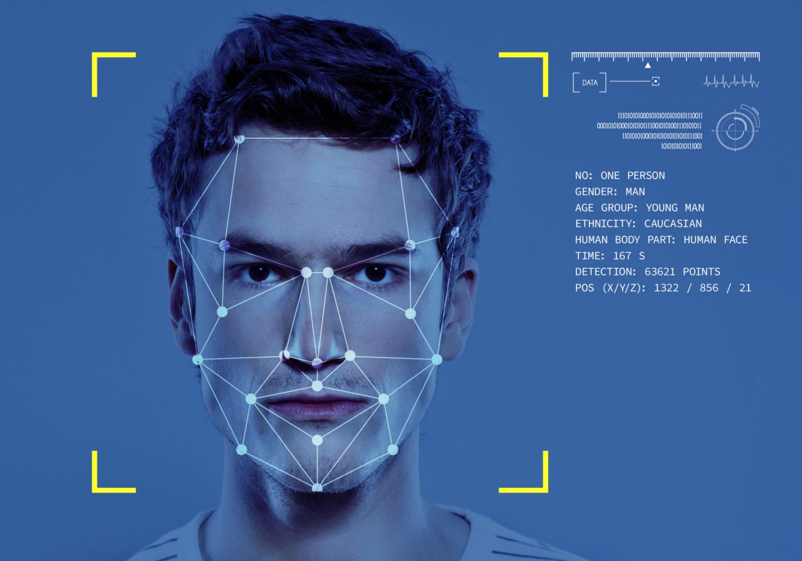

# Detección Facial en Tiempo Real con Python y OpenCV

La aplicación desarrollada es un detector facial en tiempo real que utiliza la biblioteca de visión por computadora OpenCV en Python. Al utilizar el modelo Haar Cascade, detecta las caras en una imagen de video y resalta las caras detectadas con un cuadro rojo.

La tecnología utilizada en esta aplicación es la biblioteca OpenCV en Python, que brinda una amplia variedad de herramientas y funciones para el procesamiento de imágenes y videos en tiempo real. Además, el modelo Haar Cascade utilizado para la detección de rostros es un algoritmo de aprendizaje automático que se ha entrenado para detectar patrones específicos en una imagen.

Esta aplicación es importante en la ingeniería de datos, ya que es capaz de analizar y procesar grandes cantidades de datos de imágenes y videos en tiempo real, lo que puede ser útil en aplicaciones de vigilancia y monitoreo de seguridad. También es relevante en el marketing, ya que puede ayudar a las empresas a identificar patrones de comportamiento del consumidor en tiempo real y a desarrollar estrategias de marketing más efectivas y personalizadas.

Además, esta aplicación puede ser utilizada en sistemas de identificación y autenticación biométrica, donde la detección facial se utiliza como una medida de seguridad adicional para verificar la identidad de un individuo.

En resumen, esta aplicación es esencial en la ingeniería de datos, el marketing y la seguridad debido a su capacidad para procesar grandes cantidades de datos de imágenes y videos en tiempo real y proporcionar información útil y relevante para una variedad de aplicaciones. Con su capacidad de detección facial, esta aplicación es una herramienta poderosa y versátil que puede ser utilizada en una variedad de áreas y situaciones.

# Real-Time Facial Detection with Python and OpenCV

The created application is a real-time facial detector using the OpenCV computer vision library in Python. This application uses the Haar Cascade model to detect faces in a video image and highlights the detected faces with a red box.

The technology used in this application is the OpenCV computer vision library in Python, which provides a wide variety of tools and functions for real-time image and video processing. Additionally, the Haar Cascade model used for face detection is a machine learning algorithm that has been trained to detect specific patterns in an image.

The importance of this application in data engineering lies in its ability to analyze and process large amounts of image and video data in real-time, which can be useful in security surveillance and monitoring applications.

In marketing, this application can be used to identify real-time consumer behavior patterns, which can help businesses develop more effective and personalized marketing strategies.

Regarding security, this application can be used in biometric identification and authentication systems, where facial detection is used as an additional security measure to verify an individual's identity.

In conclusion, this application is important in data engineering, marketing, and security due to its ability to process large amounts of image and video data in real-time and provide useful and relevant information for a variety of applications.
